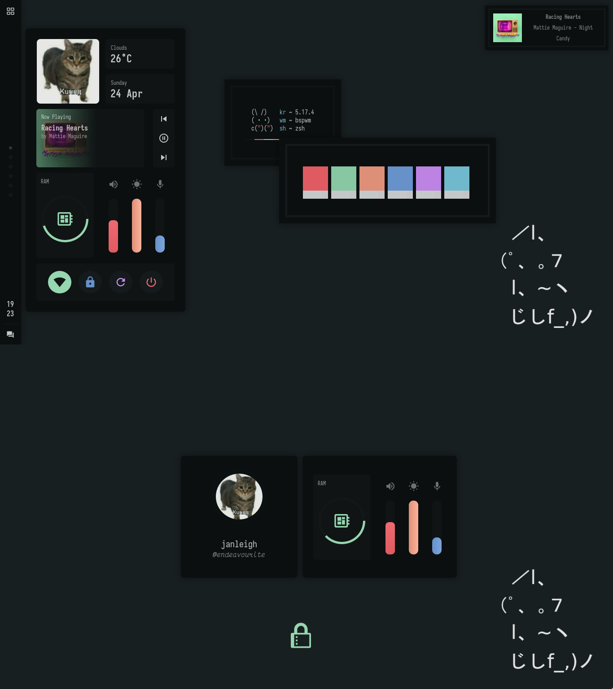

<h2 align="center"> ━━━━━━  ❖  ━━━━━━ </h2>

<!-- BADGES -->
<div align="center">
   <p></p>
   <a href="https://github.com/janleigh/dotfiles/stargazers">
      
   </a>
   <a href="https://github.com/janleigh/dotfiles/network/members/">
      
   </a>
   <a href="https://github.com/janleigh/dotfiles/">
      
   </a>
   <a href="LICENSE.md">
      
   </a>
   <br>
</div>

<p/>

<h2></h2>

<!-- INFORMATION -->
## :herb: <samp>INFORMATION</samp> 

   

   Thanks for dropping by! This is my personal repository of my dotfiles.

   The [setup section](#-setup) will guide you through a step-by-step installation process.

   Here are more information about my setup:

   - **OS:** [Arch Linux](https://archlinux.org)
   - **WM:** [bspwm](https://github.com/baskerville/bspwm)
   - **Terminal:** [alacritty](https://github.com/alacritty/alacritty)
   - **Shell:** [zsh](https://www.zsh.org/)
   - **Panel:** [eww](https://github.com/elkowar/eww)
   - **Compositor:** [picom](https://github.com/yshui/picom)
   - **Editor:** [neovim](https://github.com/neovim/neovim)
   - **Browser:** [firefox](https://www.mozilla.org/en-US/firefox)
   - **File Manager:** [thunar](https://github.com/xfce-mirror/thunar)
   - **Application Launcher:** [rofi](https://github.com/davatorium/rofi)

<!-- SETUP -->
## :wrench: <samp>SETUP</samp>

   This is step-by-step how to install these dotfiles. Just [R.T.F.M](https://en.wikipedia.org/wiki/RTFM).

   First of all, this repository contains submodules. Ensure they are updated before installing.
   ```sh
    $ git clone --recurse-submodules https://github.com/janleigh/dotfiles.git
    $ cd dotfiles && git submodule update --remote --merge
   ```

   ### :blossom: <samp>INSTALLATION (DEPENDENCIES)<samp>
   
   <details>
   <summary><strong>Arch Linux (and other Arch-based distributions)</strong></summary>

   > Assuming your **AUR Helper** is [paru](https://github.com/Morganamilo/paru).

   ```sh
    $ paru -S bspwm sxhkd rofi neovim alacritty viewnior picom brightnessctl playerctl \
              hsetroot maim jq xclip imagemagick dunst i3lock-color xdo giph --needed
   ```

   </details>

   <details>
   <summary><strong>Debian (and other debian-based distributions)</strong></summary>

   > **W I P**

   </details>

   ### :cherry_blossom: <samp>INSTALLATION (DOTFILES)<samp>

   Then after the dependencies are installed, copy the files to it's respective folders.

   <details>
   <summary><strong>Fonts</strong></summary>

   |   Font List    |
   | -------------- |
   | [`Sarasa Mono CL`](https://github.com/be5invis/Sarasa-Gothic) |
   | [`Victor Mono`](https://github.com/rubjo/victor-mono) |
   | [`DM Sans`](https://fonts.google.com/specimen/DM+Sans) |
   | [`Material Icons`](https://github.com/google/material-design-icons/) |
   | [`Icomoon`](https://icomoon.io/) |

   > **NOTE**: Only important fonts has been listed on the table above.

   ```sh
    $ cp -r ./etc/fonts/* $HOME/.local/share/fonts
   ```

   </details>

   <details>
   <summary><strong>Wallpaper</strong></summary>

   |   File Name    |  Alias  |
   | -------------- | ------- |
   | [`personal-10.jpg`](https://github.com/janleigh/walls/blob/master/personal/personal-10.png) | Solid `#192022` background with cat ASCII art. |
   | [`personal-6.jpg`](https://github.com/janleigh/walls/blob/master/personal/personal-6.jpg) | Rocky beach. |

   > **NOTE**: Only favorite wallpapers has been listed on the table above.

   ```sh
    $ mkdir -p $HOME/Pictures/walls/personal && cp -r ./etc/walls/personal/personal-10.png $HOME/Pictures/walls/personal
   ```

   </details>

   <details>
   <summary><strong>Configuration Files and Binaries</strong></summary>

   - `cp` method

      ```sh
      $ mkdir -p $HOME/.config/ && cp -r ./cfg/* $HOME/.config/
      $ mkdir -p $HOME/.local/bin/ && cp -r ./bin/* $HOME/.local/bin/

      # To make tabbed and chwb2 to work, you must move it to /usr/local/bin.
      $ sudo mv $HOME/.local/bin/usr/* /usr/local/bin/
      ```

   - `rsync` method <kbd>**UNTESTED**</kbd>

      ```sh
      $ rsync -avxHAXP cfg/ $HOME/.config
      $ rsync -avxHAXP --exclude 'bin/usr/' bin/ $HOME/.local/bin/

      # To make tabbed and chwb2 to work, you must move it to /usr/local/bin.
      $ sudo rsync -avxHAXP bin/usr/ /usr/local/bin/
      ```

      > **WARNING**: Ensure the `rsync` command must be correct as above.
      > 
      > |   Options   |                      Function                         |
      > | ----------- | ----------------------------------------------------- |
      > | `-a`        | Archive mode                                          |
      > | `-v`        | Verbose mode                                          |
      > | `-x`        | Don't cross filesystem boundaries                     |
      > | `-H`        | Preserve hard links                                   |
      > | `-A`        | Preserve ACLs/permissions                             |
      > | `-X`        | Preserve extended attributes                          |
      > | `-P`        | Show progress during transfer                         |
      > | `--exclude` | Exclude files matching `PATTERN`                      |
      >
      > **DIFFERENCES**  
      > - `cp` is for duplicating stuff and by default only ensures files have unique full path names.
      > - `rsync` is for synchronizing stuff and uses size and timestamp of files to decide if they should be replaced.

      > I also recommend to not delete the **dotfiles** directory after cloning to make upgrades easier.

   </details>

   ### :hibiscus: <samp>INSTALLATION (FINALIZING)<samp>

   Once finished copying the files, you might want to finalize the changes to your system.

   <details>
   <summary><strong>Regenerating font cache</strong></summary>

   > This ensures all existing caches are cleared and regenerated for all installed fonts.

   ```sh
    $ fc-cache -v
   ```

   </details>

   <details>
   <summary><strong>Finishing step</strong></summary>

   > Lastly, log out from your current desktop session and log in into bspwm.

   </details>

## :rocket: <samp>MISCELLANEOUS</samp>

   - **Elkowar's Wacky Widgets** 
      <details>
      <summary><strong>See</strong></summary>

      > If you're **NOT** using a monitor with a 1366x768 resolution, you might want to change the `x` and `y` values **AND** the margins and paddings of the SCSS of the widgets on the config.

      </details>

   - **GTK and Icon Theme**
      <details>
      <summary><strong>See</strong></summary>

      > You can find the custom GTK theme [here](https://github.com/janleigh/gtk3). You can then apply it by changing the `gtk-theme-name` to `kizus_phocus` on your GTK3 config. For the icon theme, you can install [Zafiro Icons](https://github.com/zayronxio/Zafiro-icons/) icon theme since it suits the GTK theme.

      </details>

   - **Firefox Custom CSS <kbd>Suggested</kbd>**
      <details>
      <summary><strong>See</strong></summary>

      > You can install the custom Firefox CSS by first enabling `toolkit.legacyUserProfileCustomizations.stylesheets` in `about:config` and move the contents of [`etc/firefox-css`](etc/firefox-css) to `$HOME/.mozilla/firefox/*.default-release/chrome`.

      </details>

   - **Replacement Commands <kbd>Suggested</kbd>**
      <details>
      <summary><strong>See</strong></summary>

      > Assuming you're also using my [zsh](https://www.zsh.org/) config, you might also want to install some additional dependencies to make some commands work.

      - `ls` ➜ [`exa`](https://github.com/ogham/exa)
      - `cat` ➜ [`bat`](https://github.com/sharkdp/bat)
      - `df` ➜ [`duf`](https://github.com/muesli/duf)

      </details>

## :japan: <samp>GALLERY</samp>

   <details open>
   <summary><strong>Star History</strong></summary>

   <a target="_blank" href="https://starchart.cc/janleigh/dotfiles">
      
   </a>
   </details>

## :tada: <samp>ACKNOWLEDGEMENTS</samp>

   - **Inspiration**
      - [owl4ce](https://github.com/owl4ce) for the README style.

   - **Contributors**
      - [flyingcakes85](https://github.com/flyingcakes85) for the **OLD** 1920x1080 eww config. 

         <a href="https://github.com/janleigh/dotfiles/graphs/contributors">
            
         </a>

<p align="center">
   
</p>