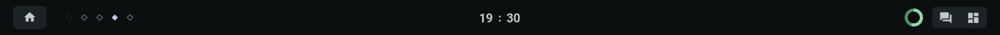
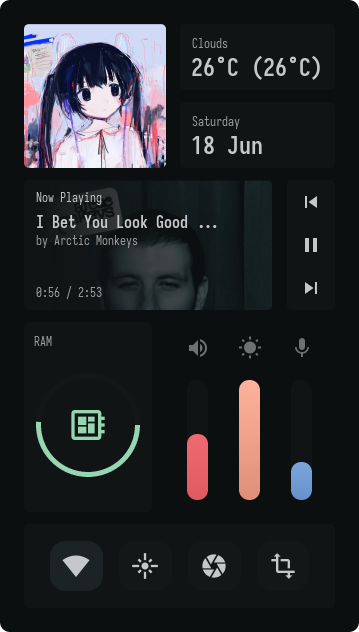
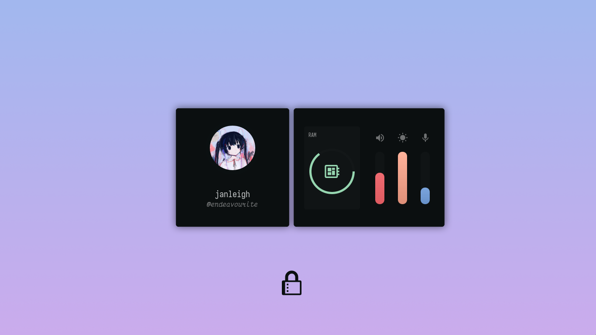

<h2 align="center"> ━━━━━━  ❖  ━━━━━━ </h2>

<!-- BADGES -->
<div align="center">
   <p></p>
   <a href="">
      
   </a>
   <a href="https://github.com/janleigh/dotfiles/stargazers">
      
   </a>
   <a href="https://github.com/janleigh/dotfiles/">
      
   </a>
   <br>
</div>
<div align="center">
   <p></p>
   <a href="https://discord.gg/2RfJb3CVfb">
      
   </a>
   <br>
</div>

<p/>

<h2></h2>

<!-- INFORMATION -->
## :herb: <samp>INFORMATION</samp> 

   

   Thanks for dropping by! This is my personal repository of my dotfiles.

   The [setup section](#-setup) will guide you through a step-by-step installation process.

   Here are more information about my setup:

   - **Window Manager:** [bspwm](https://github.com/baskerville/bspwm)
   - **Terminal:** [alacritty](https://github.com/alacritty/alacritty)
   - **Shell:** [zsh](https://www.zsh.org/)
   - **Panel:** [eww](https://github.com/elkowar/eww)
   - **Compositor:** [picom](https://github.com/yshui/picom)
   - **Editor:** [neovim](https://github.com/neovim/neovim)
   - **Browser:** [firefox](https://www.mozilla.org/en-US/firefox)
   - **Notification Manager:** [dunst](https://github.com/dunst-project/dunst)
   - **File Manager:** [thunar](https://github.com/xfce-mirror/thunar)
   - **Application Launcher:** [rofi](https://github.com/davatorium/rofi)

<!-- SETUP -->
## :wrench: <samp>SETUP</samp>

   This is step-by-step how to install these dotfiles. Just [R.T.F.M](https://en.wikipedia.org/wiki/RTFM).

   First of all, this repository contains submodules. Ensure they are updated before installing.

   > Make sure to have [Git LFS](https://git-lfs.github.com) installed since it's being used for the wallpaper submodule.
   ```sh
    $ git clone --recurse-submodules https://github.com/janleigh/dotfiles.git
    $ cd dotfiles && git submodule update --remote --merge
   ```

   ### <samp><kbd>I.</kbd> INSTALLATION (DEPENDENCIES)<samp>
   
   <details>
   <summary><strong>Arch Linux (and other Arch-based distributions)</strong></summary>

   > Assuming your **AUR Helper** is [paru](https://github.com/Morganamilo/paru).

   ```sh
    $ paru -S --needed bspwm sxhkd rofi neovim alacritty viewnior picom brightnessctl \
              playerctl hsetroot maim jq xclip imagemagick dunst i3lock-color xdo giph \ 
              jgmenu redshift
   ```

   </details>

   <details>
   <summary><strong>Debian (and other Debian-based distributions)</strong></summary>

   ```sh
    $ sudo apt install --no-install-recommends bspwm sxhkd rofi neovim alacritty viewnior \
                     picom brightnessctl playerctl mpd mpdris2 hsetroot maim jq xclip \
                     imagemagick xdo jgmenu
   ```

   > For `i3-lock` and `giph`, you need to build it from source.

   **``i3lock``**

   ```sh
    $ sudo apt install autoconf gcc make pkg-config libpam0g-dev libcairo2-dev libfontconfig1-dev \
                     libxcb-composite0-dev libev-dev libx11-xcb-dev libxcb-xkb-dev libxcb-xinerama0-dev \
                     libxcb-randr0-dev libxcb-image0-dev libxcb-util0-dev libxcb-xrm-dev libxkbcommon-dev \
                     libxkbcommon-x11-dev libjpeg-dev
   ```
   ```sh
    $ git clone https://github.com/Raymo111/i3lock-color.git
    $ cd i3lock-color
   ```
   ```sh
    $ ./build.sh
   ```
   ```sh
    $ ./install-i3lock-color.sh
   ```

   **``giph``**

   ```sh
    $ sudo apt install ffmpeg xdotools
   ```
   ```sh
    $ git clone https://github.com/phisch/giph.git
    $ cd giph
    $ sudo make install
   ```

   </details>

   ### <samp><kbd>II.</kbd> INSTALLATION (DOTFILES)<samp>

   Then after the dependencies are installed, copy the files to it's respective folders.

   <details>
   <summary><strong>Fonts</strong></summary>

   |    Font List     |  Use  |
   | :--------------: | :---: |
   | [`Sarasa Mono CL`](https://github.com/be5invis/Sarasa-Gothic) | Main Font |
   | [`Victor Mono`](https://github.com/rubjo/victor-mono) | Stylish Italic Font |
   | [`DM Sans`](https://fonts.google.com/specimen/DM+Sans) | Main UI Font |
   | [`Material Icons`](https://github.com/google/material-design-icons/) | Main Icon Font |
   | [`Icomoon`](https://icomoon.io/) | Secondary Icon Font |

   > **NOTE**: Only important fonts has been listed on the table above.

   ```sh
    $ cp -r ./etc/fonts/* $HOME/.local/share/fonts
   ```

   </details>

   <details>
   <summary><strong>Wallpaper</strong></summary>

   |   File Name    |  Alias  |
   | -------------- | ------- |
   | [`comfy_waves.jpg`](https://github.com/janleigh/walls/blob/master/real/comfy_waves.jpg) | Comfy waves. |

   > **NOTE**: Only favorite wallpapers has been listed on the table above.

   ```sh
    $ mkdir -p $HOME/Pictures/walls/real && cp -r ./etc/walls/real/comfy_waves.jpg $HOME/Pictures/walls/real
   ```

   </details>

   <details>
   <summary><strong>Configuration Files and Binaries</strong></summary>

   - `rsync` method <kbd>**RECOMMENDED**</kbd>

      ```sh
       $ mkdir -p $HOME/.config/ && rsync -avxHAXP cfg/ $HOME/.config
       $ mkdir -p $HOME/.local/bin/ && rsync -avxHAXP --exclude 'bin/usr/' bin/ $HOME/.local/bin/

       # To make tabbed and chwb2 to work, you must move it to /usr/local/bin.
       $ sudo rsync -avxHAXP bin/usr/ /usr/local/bin/
      ```

      > **WARNING**: Ensure the `rsync` command must be correct as above.
      > 
      > |   Options   |                      Function                         |
      > | ----------- | ----------------------------------------------------- |
      > | `-a`        | Archive mode                                          |
      > | `-v`        | Verbose mode                                          |
      > | `-x`        | Don't cross filesystem boundaries                     |
      > | `-H`        | Preserve hard links                                   |
      > | `-A`        | Preserve ACLs/permissions                             |
      > | `-X`        | Preserve extended attributes                          |
      > | `-P`        | Show progress during transfer                         |
      > | `--exclude` | Exclude files matching `PATTERN`                      |

   - `cp` method

      ```sh
       $ mkdir -p $HOME/.config/ && cp -r ./cfg/* $HOME/.config/
       $ mkdir -p $HOME/.local/bin/ && cp -r ./bin/* $HOME/.local/bin/

       # To make tabbed and chwb2 to work, you must move it to /usr/local/bin.
       $ sudo mv $HOME/.local/bin/usr/* /usr/local/bin/
      ```

   > **DIFFERENCES**  
   > - `cp` is for duplicating stuff and by default only ensures files have unique full path names.
   > - `rsync` is for synchronizing stuff and uses size and timestamp of files to decide if they should be replaced.

   > I also recommend to not delete the **dotfiles** directory after cloning to make upgrades easier.

   </details>

   ### <samp><kbd>III.</kbd> INSTALLATION (FINALIZING)<samp>

   Once finished copying the files, you might want to finalize the changes to your system.

   <details>
   <summary><strong>Regenerating font cache</strong></summary>

   > This ensures all existing caches are cleared and regenerated for all installed fonts.

   ```sh
    $ fc-cache -v
   ```

   </details>

   <details>
   <summary><strong>Finalizing installation</strong></summary>

   > Lastly, log out from your current desktop session and log in into bspwm.

   > If you're using [`~/.xinitrc`](https://wiki.archlinux.org/title/Xinit), simply add the following line at the end.

   ```sh
    exec bspwm
   ```

   </details>

## :rocket: <samp>MISCELLANEOUS</samp>

   - **GTK and Icon Theme**
      <details>
      <summary><strong>See</strong></summary>

      > You can find the custom GTK theme [here](https://github.com/janleigh/gtk3). You can then apply it by changing the value of `gtk-theme-name` to `kizus_phocus` on your GTK3 config. 
      
      > For the icon theme, you can install [Zafiro Icons](https://github.com/zayronxio/Zafiro-icons/) icon theme since it suits the GTK theme.

      </details>

   - **Cursor Theme**
      <details>
      <summary><strong>See</strong></summary>

      > You can install [volantes-cursors](https://github.com/varlesh/volantes-cursors) or [phinger-cursors](https://github.com/phisch/phinger-cursors) cursor themes since it blends well with the overall desktop.

      </details>

   - **Firefox Custom CSS <kbd>OPTIONAL</kbd>**
      <details>
      <summary><strong>See</strong></summary>

      > You can install the custom Firefox CSS by first enabling `toolkit.legacyUserProfileCustomizations.stylesheets` in `about:config` and move the contents of [`etc/firefox-css`](etc/firefox-css) to `$HOME/.mozilla/firefox/xxxxxxxx.default-release/chrome`.

      </details>

   - **Replacement Commands <kbd>OPTIONAL</kbd>**
      <details>
      <summary><strong>See</strong></summary>

      > Assuming you're also using my [zsh](https://www.zsh.org/) config, you might also want to install some additional dependencies to make some commands work.

      - `ls` ➜ [`exa`](https://github.com/ogham/exa)
      - `cat` ➜ [`bat`](https://github.com/sharkdp/bat)
      - `df` ➜ [`duf`](https://github.com/muesli/duf)

      </details>

## :japan: <samp>GALLERY</samp>

   | <b>Minimal Vertical Bar</b> |
   | :-------------------------: |
   |  |

   | <b>Dashboard / Action Center</b> |
   | :----------------------------: |
   |  |

   | <b>Lockscreen</b> |
   | :---------------: |
   |  |

## :money_with_wings: <samp>TIP JAR</samp>

   If you enjoyed it and would like to show your appreciation, you may want to tip me here.

   It is never required but always appreciated. Thanks from the bottom of my heart!

   |  Donate With  |                      Address                       |
   | :-----------: | :------------------------------------------------: |
   |     Ko-fi     |     [Click Here](https://ko-fi.com/M4M272EAY)      |
   |    PayPal     | [Click Here](https://paypal.me/JanLeighAugustineM) |

## :tada: <samp>ACKNOWLEDGEMENTS</samp>

   - **Inspiration**
      - [owl4ce](https://github.com/owl4ce) for the README style.

   - **Contributors**
      - [flyingcakes85](https://github.com/flyingcakes85) for the **OLD** 1920x1080 eww config. 
      - [Deathemon](https://github.com/Deathemonic) for the dynamic music player, network support of the dashboard and maintaining the wiki.

         <a href="https://github.com/janleigh/dotfiles/graphs/contributors">
            
         </a>

<p align="center">
   
</p>
